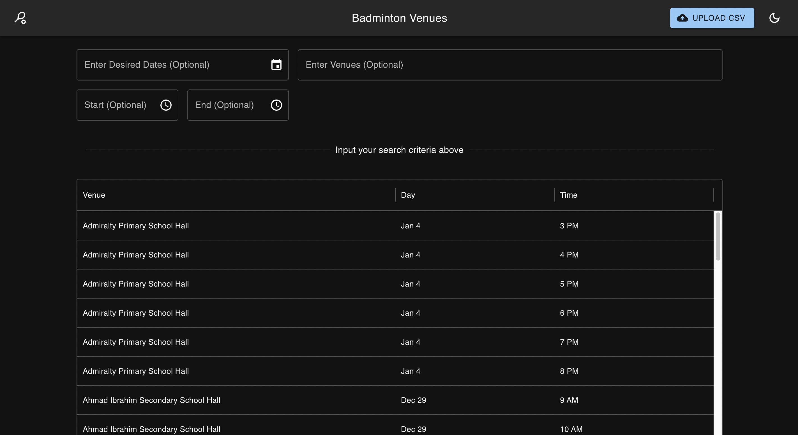

# ActiveSG Badminton Venue Availability Scraper

This project consists of a Python-based scraper and a Flask API that automates the process of checking and saving available timeslots for venues listed on the ActiveSG website. The scraper utilizes Selenium for browser automation and BeautifulSoup for HTML parsing, and outputs the results in a CSV file for easy viewing. The Flask API provides endpoints to interact with the scraped data stored in a MongoDB database.

## Features

- **Scraper**: Automates the process of checking available timeslots for badminton venues on the ActiveSG website.
- **API**: Provides endpoints to upload CSV files, scrape data, and query available timeslots.
- **Database**: Uses MongoDB to store and query venue availability data.
- **Frontend**: React-based frontend to interact with the API and display available timeslots.

## Setup

### Prerequisites

- [Docker](https://www.docker.com/get-started)
- [Docker Compose](https://docs.docker.com/compose/install/)
- [Python](https://www.python.org/downloads/)
- [Node.js](https://nodejs.org/en/download/)
- [npm](https://www.npmjs.com/get-npm)

### Getting Started

#### Cloning the Repository

```sh
git clone git@github.com:gabrielojh/activesg-bot.git
cd activesg-bot
```

#### Scraper Standalone
The python scraper can be run on its own without starting the backend, database and frontend

```sh
# Ensure that you are in the root directory and have python installed

# Create a virtual environment
python -m venv venv

# Activate the virtual environment (Mac Command)
source venv/bin/activate

# Download the necessary modules
pip install -r requirements.txt

# Run the scraper
python scraper.py
```

#### Fullstack
Running the fullstack application is simple, just use the provided docker compose file
```sh
# Ensure that you are in the root directory
docker-compose up --build
```
The API will be available at `http://localhost:8080/`

The Website will be available at `http://localhost:5173/`

## API Endpoints

The ActiveSG Badminton API allows users to scrape venue availability data from the ActiveSG website, upload CSV files, and query available timeslots. Below is the detailed documentation for the available endpoints.

### **1. Health Check**
- **URL**: `/`
- **Method**: `GET`
- **Description**: Check if the backend server is running
- **Response**:
  ```json
  {
    "status": "healthy"
  }
  ```

---

### **2. Scrape ActiveSG Data**
- **URL**: `/scrape`
- **Method**: `GET`
- **Description**: Scrape available timeslots from the ActiveSG website
- **Response**:
  ```json
  [
    {
      "Venue": "Choa Chu Kang Sport Hall",
      "Date": "2024-12-18",
      "Timeslot": "7:00 am"
    },
    ...
  ]
  ```
- **Notes**:
  - Data will be saved in MongoDB

---

### **3. Upload CSV File**
- **URL**: `/files/upload`
- **Method**: `POST`
- **Description**: Upload a CSV file containing venue availability data
- **Headers**:
  - `Content-Type`: `multipart/form-data`
- **Request Body**:
  - `file`: CSV file containing venue data.
- **Response**:
  ```json
  {
    "status": "ok"
  }
  ```
- **Error Responses**:
  - Missing file:
    ```json
    {
      "error": "No file part"
    }
    ```
  - Duplicate data:
    ```json
    {
      "error": "Duplicate key error"
    }
    ```

---

### **4. Query Available Timeslots**
- **URL**: `/venues`
- **Method**: `POST`
- **Description**: Query venues for available timeslots
- **Headers**:
  - `Content-Type`: `application/json`
- **Request Body**:
  ```json
  {
    "venue": ["Choa Chu Kang Sport Hall"],  // Optional: List of venues
    "date": "2024-12-18",                 // Optional: Specific date in ISO format
    "startTime": "07:00",                 // Optional: Start time in HH:mm format
    "endTime": "09:00"                    // Optional: End time in HH:mm format
  }
  ```
- **Response**:
  ```json
  [
    {
      "Venue": "Choa Chu Kang Sport Hall",
      "DateTime": "2024-12-18T07:00:00",
      "Timeslot": "7:00 am"
    },
    ...
  ]
  ```
- **Error Response**:
  ```json
  {
    "error": "Error fetching data"
  }
  ```

## Frontend Usage



---

## **Using the Frontend**

The frontend allows users to view, filter, and interact with the scraped badminton venue data, which is stored in the MongoDB collection. The following sections describe the main features and functionality of the interface.

---

### **1. Upload CSV Button**
- **Purpose**: This button uploads a CSV file (generated by the scraper) to populate the MongoDB collection with venue availability data.
- **Steps**:
  1. Click the **"Upload CSV"** button located in the top-right corner of the interface.
  2. Select the CSV file generated by the scraper from your local machine.
  3. Once uploaded, the CSV data is stored in MongoDB and immediately reflected in the table below.

---

### **2. Table of Results**
- **Purpose**: Displays the list of venues, their availability dates, and timeslots.
- **Columns**:
  - **Venue**: The name of the badminton venue.
  - **Day**: The date of the available timeslot.
  - **Time**: The timeslot for the venue.
- **Filtering**:
  - Use the search inputs above the table to filter results based on:
    - Desired Date (optional)
    - Venue Name (optional)
    - Start Time (optional)
    - End Time (optional)
- **Dynamic Filtering**:
  - Results in the table automatically update as you enter filtering criteria.

---

### **3. Run Scraper (WIP)**
- **Purpose**: This feature (currently a work-in-progress) allows users to directly run the scraper from the frontend without needing to execute it separately in Python.
- **Expected Workflow**:
  1. Click the **"Run Scraper"** button (to be implemented).
  2. The scraper will fetch the latest availability data from ActiveSG.
  3. Newly scraped data will automatically update the MongoDB collection and reflect in the table.

---

### **4. Filtering Options**
- **Enter Desired Dates (Optional)**:
  - Filter results to show timeslots available for a specific date or date range.
  - Use the date picker to select dates.
- **Start (Optional)** and **End (Optional)**:
  - Narrow results to show timeslots available between specific times on a given day.
- **Enter Venues (Optional)**:
  - Type the name of one or more venues to filter results specific to those venues.

---

### **5. Refresh**
- **Purpose**: Refresh the table to ensure it reflects the latest data in the MongoDB collection.
- **Steps**:
  1. Click the **refresh icon** in the top-right corner of the interface.
  2. This will reload the table with the most up-to-date data.


